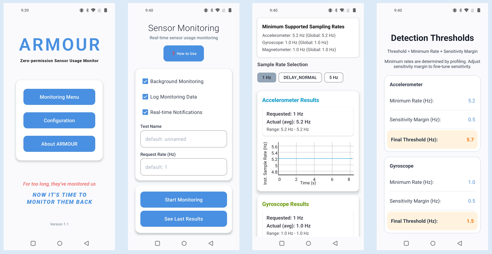
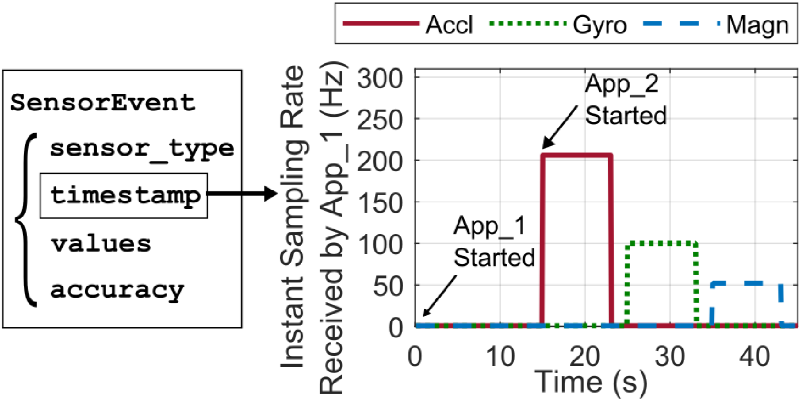

# ARMOUR   

**ARMOUR: Android Runtime Zero-permission Sensor Usage Monitoring from User Space**


## Overview

ARMOUR is a lightweight Android privacy-enhancement tool for **detecting undeclared zero-permission sensor access** by third-party apps at runtime, directly **from user space—no root, no permissions required**. Just install ARMOUR on your device and start monitoring. 



### 🔥 Motivation

Android's zero-permission sensors such as accelerometer, gyroscope, and magnetometer can be accessed by third-party applications without any user consent or notifications. Despite extensive works investigating how to collect more sensor data to enable various applications, little work has explored how to meet the needs of researchers and data providers to monitor and analyze the sensor usage. These zero-permission sensors could pose various privacy risks, including the ability to infer location, activities, or sensitive inputs like keystrokes or voice patterns (see [here](https://yanlong.site/files/wisec25-armour.pdf)). 

ARMOUR helps **restore sensor data usage transparency** by allowing users and researchers to **monitor when, which, and at what sampling rates the zero-permission sensors are accessed**.

### ⚙️ How It Works

ARMOUR leverages a property of the Android sensor framework:

> 📈 **Instant Sampling Rate Variation & Convergence Rule**  
> When multiple apps register for the same sensor, Android aligns them to the highest requested sampling rate. ARMOUR detects sensor access by measuring unexpected changes in its own sampling rate.



In short, ARMOUR requests the minimum supported sampling rates of zero-permission sensors on a device and detect actual received instant sampling rates higher than the rates requested by ARMOUR, which reveals that another app is accessing these sensors with higher sampling rates. ARMOUR works entirely in user space, requiring:
- No OS modifications
- No root privileges
- No app-specific reverse engineering


### 🚀 Features

- Detects accelerometer, gyroscope, and magnetometer usage. More zero-permission sensors can be easily added. 
- Detects access from obfuscated, native-code, and **even web-based apps**
- Works on Android 8.0+ (API 26+) and newer devices without root
- Runs quietly as a background service
- Profiling mode to calibrate detection for your device


## Usage  

### 🎞️ Demo

<div align="center" style="display: flex; justify-content: left; gap: 20px; flex-wrap: wrap;">

  <div style="text-align: center; width: 200px; margin: 0 20px;">
    <p><strong>Example 1:<br>No access, and controlled access to all three sensors</strong></p>
    
  </div>

  <div style="text-align: center; width: 200px; margin: 0 20px;">
    <p><strong>Example 2:<br>Shein accessing gyroscope detected</strong></p>
    
  </div>

  <div style="text-align: center; width: 200px; margin: 0 20px;">
    <p><strong>Example 3:<br>Taobao accessing all three sensors detected</strong></p>
    
  </div>

</div>


### 📦 Installation

You can either install the prebuilt APK or build the project from source.

#### 🔹 Option 1: Install Prebuilt APK
Download and install the APK from the [Releases page](https://github.com/longyan97/ARMOUR/releases/tag/v1.0).

#### 🔹 Option 2: Build from Source

1. Clone the repository:
   ```bash
   git clone https://github.com/longyan97/ARMOUR.git
2. Open the project in Android Studio.
3. Ensure you have the necessary SDK and API levels installed:
   - Minimum SDK version: 29
   - Target SDK version: 34
   - Compile API Level: 35

### ➤ Step 1: Device Profiling

Run ARMOUR in profiling mode to determine the minimum supported sampling rates for each sensor on your device. This calibration ensures accurate detection thresholds.

1. Open ARMOUR.
2. Select **Profiling Mode**.
3. Wait for completion (~30 seconds).
4. Thresholds will be stored internally for later use. You can also manually change it later in the config menu.

### ➤ Step 2: Monitoring

Keep ARMOUR running in the background. Launch the third-party app you want to analyze.

1. Switch ARMOUR to **Monitoring Mode**.
2. Open the target app and interact with it.
3. ARMOUR will log changes in instant sampling rates.

### ➤ Step 3: Analyze Results

Collected data is stored locally on the device. Use ARMOUR's built-in log viewer or export logs to a PC for offline analysis.


## Findings & Dataset
Using ARMOUR, we have examined more than 1,400 Google Play applications of 35 different categories. A significant number of sensor data abuse problems were found:

- Zero-permission sensor data is already being used **by marketing services for user/device tracking**.
- **>40% of zero-permission sensor usage** in 14 categories. 
- Many unexpected usage, such as **~50% of Books/Reference apps** using all three sensors.
- **~0% of apps** declared the reason for zero-permission sensor access.  
- Some apps keep accessing sensors **even after being terminated by users**. 
- **OEMs may not comply** with the sampling rate limiting policies of Android.    

### 🗂️ Dataset

The zero-permission sensor access dataset we collected is available here: https://github.com/ARMOUR-monitor/ARMOUR-monitor.github.io/tree/main/static  
You can also use the visualization tool we created to analyze the dataset: https://armour-monitor.github.io/


### 📝 More Information 

ARMOUR is developed by researchers from Northeastern University, Ohio State University, and the University of Michigan. For more detailed information, you can refer to the [original research paper](https://yanlong.site/files/wisec25-armour.pdf). If you would like to chat with the authors, you can contact
- [Yan Long](https://yanlong.site/) (yanlong@umich.edu)
- [Jiancong Cui](https://jiancongcui.github.io/) (cui.jianc@northeastern.edu)
- [Yuqing Yang](https://frostwing98.com/) (yang.5656@osu.edu)
<br> <br>


<br>
If you find ARMOUR useful in your research or publications, you can cite ARMOUR:

```
@inproceedings{long2025armour,
  title={ARMOUR US: Android Runtime Zero-permission Sensor Usage Monitoring from User Space},
  author={Long, Yan and Cui, Jiancong and Yang, Yuqing and Alam, Tobias and Lin, Zhiqiang and Fu, Kevin},
  booktitle={Proceedings of the 18th ACM conference on security and privacy in wireless and mobile networks},
  year={2025}
}
```


## Contributing

Contributions are welcome! If you'd like to help improve ARMOUR. We also welcome researchers and developers into integrate ARMOUR's detection principle in their works. 

### 🔧 Examples of Areas to Improve
- Add support for more sensors (e.g., ambient light, proximity)
- Add real-time notification and suspicious app detection functionalities, such as using `Android Accessibility`
- Integrate with testing frameworks like `uiautomator` or `Appium`

### 🧭 How to Contribute
1. Fork the repository
2. Create a new feature branch
3. Commit your changes and push to your fork
5. Open a pull request
> Please include clear descriptions and relevant issue references if applicable.